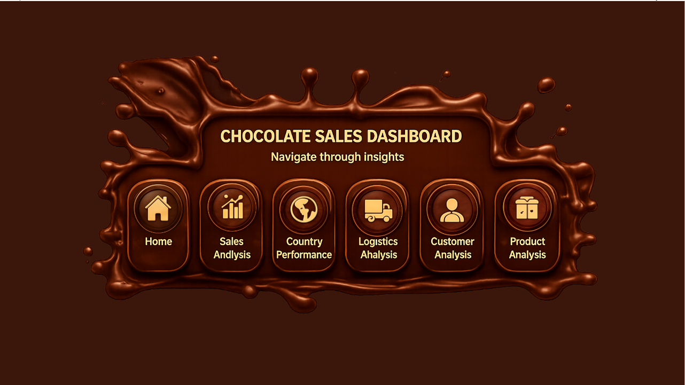
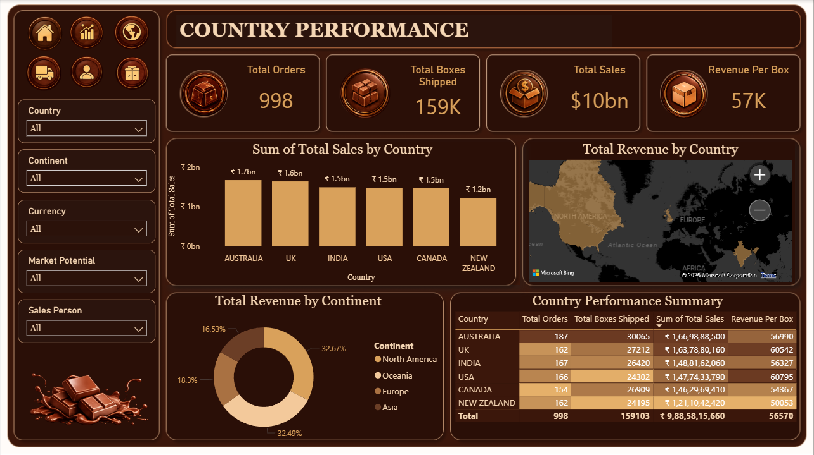
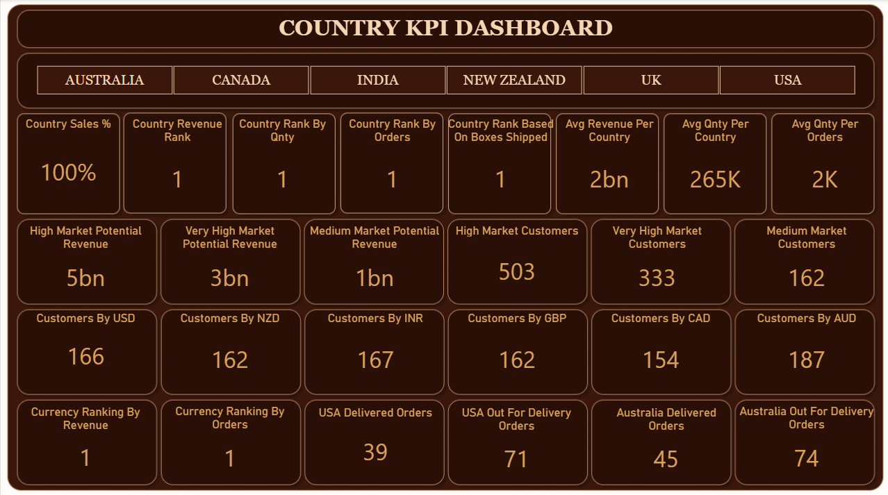
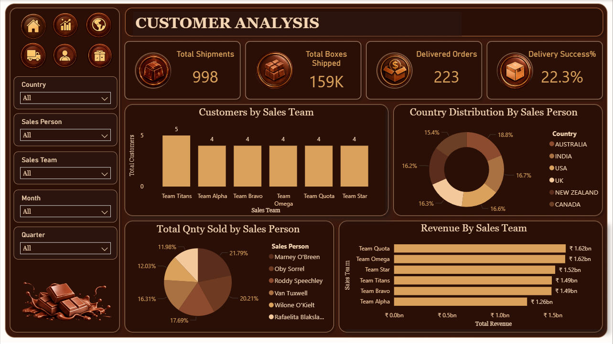
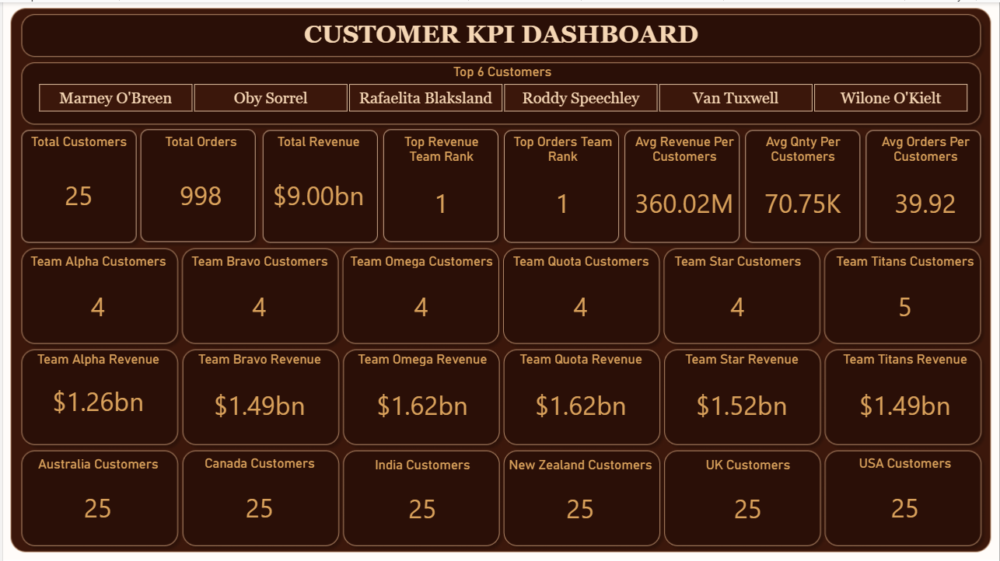
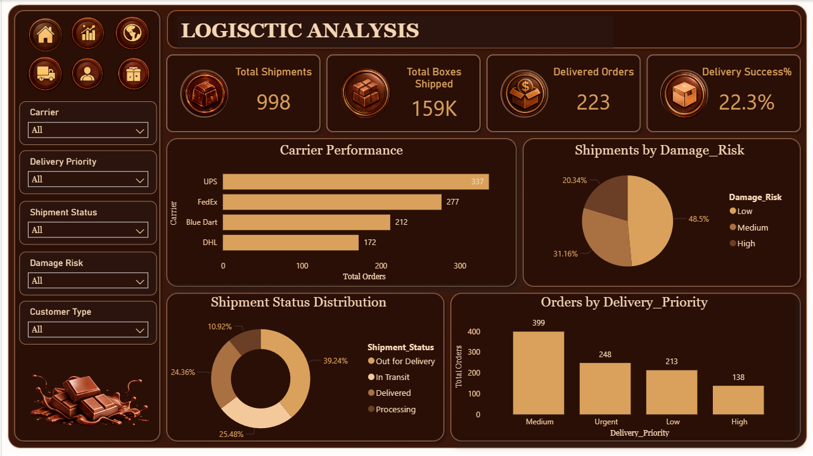
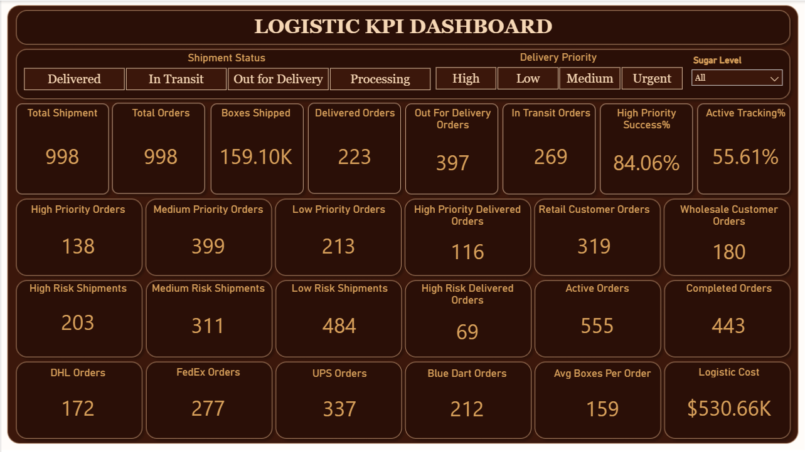
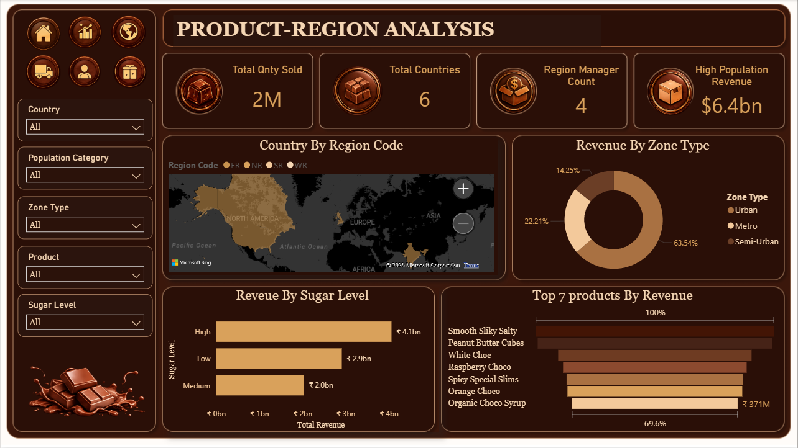
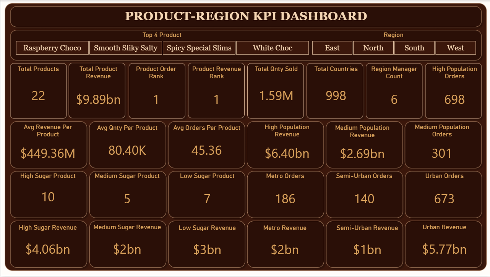

# 🍫 Chocolate Sales Dashboard

<p align="center">
  
</p>

An end-to-end **Business Intelligence and Data Analytics** project that transforms raw chocolate sales data into meaningful business insights using **Excel, Power BI, Power Query, and DAX**.

---

# 📌 Project Overview

This project demonstrates the complete Business Intelligence workflow—from collecting and transforming raw sales data to designing interactive Power BI dashboards for business decision-making.

The dashboard provides a comprehensive analysis of:

- Sales Performance
- Country-wise Performance
- Customer Analysis
- Product Performance
- Logistics Performance
- KPI Monitoring

The goal is to help stakeholders identify sales trends, monitor KPIs, and make data-driven business decisions.

---

# 🎯 Business Objectives

- Analyze total sales across different countries.
- Compare customer performance.
- Monitor logistics efficiency.
- Identify top-performing products.
- Track regional sales performance.
- Visualize KPIs using interactive dashboards.
- Enable business users to make informed decisions.

---

# 🛠 Tech Stack

- Microsoft Excel
- Power BI
- Power Query
- DAX
- Data Modeling

---

# 📂 Dataset

The project uses multiple datasets including:

- Chocolate Sales
- Country
- Products
- Sales Person
- Region
- Shipment

These datasets were cleaned, transformed, and modeled before visualization.

---

# ⚙ Data Preparation

The data preparation process included:

- Removing duplicate records
- Handling missing values
- Data type correction
- Merging multiple datasets
- Creating relationships
- Building star schema
- Creating calculated columns
- Building DAX measures

---

# 📊 Dashboard Pages

## 🏠 Home Dashboard


Provides an overview of the complete business with navigation to all analytical pages.

---

## 🌍 Country Performance



Shows:

- Country-wise Sales
- Revenue Distribution
- Performance Comparison
- Sales Trends

---

## 📈 Country KPIs



Key Metrics:

- Total Sales
- Total Orders
- Revenue
- Average Sales
- Country Rankings

---

## 👥 Customer Analysis



Analyzes:

- Customer Contribution
- Sales Distribution
- Top Customers
- Customer Revenue

---

## 📌 Customer KPIs



Includes:

- Customer Count
- Average Revenue
- Top Customers
- Customer Performance Metrics

---

## 🚚 Logistics Analysis



Provides insights into:

- Shipment Analysis
- Delivery Performance
- Logistics Trends
- Shipment Distribution

---

## 📦 Logistics KPIs



KPIs include:

- Shipment Count
- Delivery Metrics
- Logistics Performance
- Distribution Statistics

---

## 🍫 Product & Region Analysis



Visualizes:

- Product Sales
- Regional Sales
- Best Performing Products
- Sales Distribution

---

## 📊 Product & Region KPIs



Highlights:

- Product Revenue
- Region Rankings
- Product Performance
- Regional Contribution

---

# 📈 Dashboard Features

- Interactive Slicers
- Drill-through Reports
- Dynamic KPIs
- Responsive Dashboard
- Cross Filtering
- Navigation Buttons
- Interactive Charts
- Business Insights

---

# 📊 Business Insights

The dashboard helps answer important business questions such as:

- Which country generates the highest revenue?
- Which products perform best?
- Which customers contribute the most revenue?
- How efficient is the logistics process?
- Which region has the highest sales?
- What are the overall business KPIs?

---

# 📁 Project Structure

```
Chocolate-Sales-Dashboard
│
├── Dataset
│   ├── Chocolate main Data.xlsx
│   ├── Country.xlsx
│   ├── Products.xlsx
│   ├── Region.xlsx
│   ├── Sales Person.xlsx
│   └── Shipment.xlsx
│
├── Images
│   ├── Home_Page.png
│   ├── Country_Performance.png
│   ├── Country_KPIs.png
│   ├── Customer_Analysis.png
│   ├── Customer_KPIs.png
│   ├── Logistic_Analysis.png
│   ├── Logistic_KPIs.png
│   ├── Product_Region_Analysis.png
│   └── Product_Region_KPIs.png
│
├── Power BI
│   └── Chocolate_Sales_Dashboard.pbix
│
└── README.md
```

---

# 🚀 Skills Demonstrated

- Business Intelligence
- Dashboard Design
- Power BI Development
- Data Cleaning
- Data Transformation
- Power Query
- Data Modeling
- DAX
- KPI Development
- Business Analytics
- Data Visualization